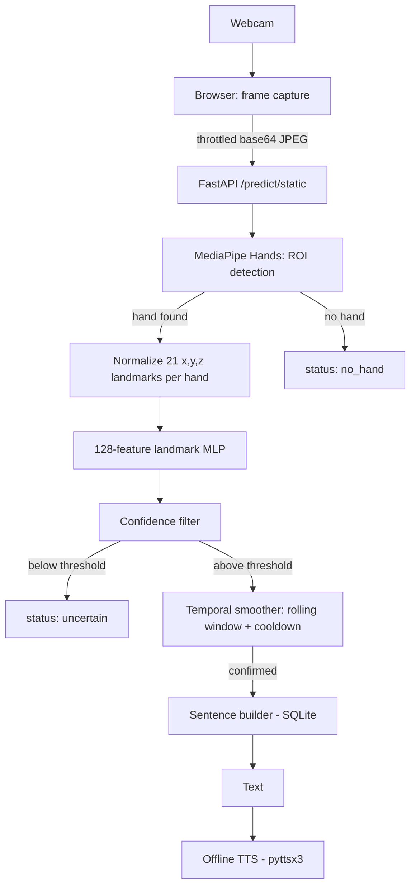
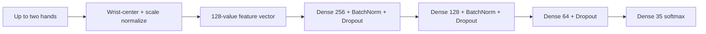
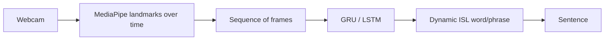

# 🤟 SignSpeak AI

**Real-Time Indian Sign Language Recognition & Speech System**

A deep learning project that recognizes static Indian Sign
Language (ISL) alphabet and numeral gestures from a webcam, builds them into editable sentences, and speaks them aloud — entirely offline.

---

## 1. Problem statement

Millions of people who use Indian Sign Language have no easy way to communicate in real time with people who don't know ISL. Most existing sign language tools are either research prototypes with no usable interface, or
rely on paid cloud APIs. SignSpeak AI closes that gap for **static
character-level signing**: point a webcam at a hand shape, and the system reads it out.

## 2. Motivation

Sign language translation is a genuinely hard, unsolved problem at the sentence/grammar level — but static character recognition (the ISL alphabet and digits) is tractable with a lightweight landmark classifier, and it's still useful: spelling out names, short words, or numbers is a real communication need. This project intentionally scopes itself to that solvable problem instead of overselling a fake "full translator."

## 3. Objectives

- Classify all 35 static ISL character classes (A–Z, 1–9) from a live webcam feed.
- Keep inference fast and stable enough for real-time use on a mid-range GPU (RTX 2050) or CPU.
- Turn a stream of confirmed characters into an editable sentence.
- Speak the sentence aloud with fully offline text-to-speech.
- Report only real, measured metrics — never fabricated accuracy numbers.

## 4. Features

- ✅ **Hand landmark visualization** — Real-time skeleton overlay with white connecting lines and red joint markers
- ✅ MediaPipe landmark MLP — 128 normalized features for up to two hands
- ✅ Automatic dataset inspection — class counts, formats, corrupt/duplicate detection
- ✅ MediaPipe-based hand detection (21 landmarks per hand) and ROI extraction
- ✅ Confidence thresholding + rolling-window temporal smoothing (no repeated-letter spam)
- ✅ Editable sentence builder (space / backspace / clear)
- ✅ Offline text-to-speech (pyttsx3, no cloud, no API key)
- ✅ SQLite-backed prediction history and analytics
- ✅ FastAPI backend with auto-generated REST API docs
- ✅ React + Tailwind dashboard with live analytics, dataset explorer, and model inspector
- ✅ Comprehensive test suite (dataset, model, API, sentence builder)

## 5. Dataset

**Indian Sign Language (ISL)** — Kaggle,
[prathumarikeri/indian-sign-language-isl](https://www.kaggle.com/datasets/prathumarikeri/indian-sign-language-isl).
35 classes: letters A–Z and digits 1–9 (no "0" class).

### 6. Dataset statistics (real, measured)

Generated by `backend/ml/dataset_inspector.py` against the actual extracted dataset:

| Metric | Value |
|---|---|
| Total classes | 35 |
| Total images | 42,745 |
| Image format | JPG (100%) |
| Min / max dimensions | 128×128 / 1088×1920 |
| Most common dimension | 128×128 |
| Corrupted images | 0 |
| Duplicate images | 1 |
| Class count range | 1,200 – 1,447 images (1.21× imbalance) |

Full machine-readable report: `backend/datasets/dataset_report.json`
(regenerate any time with `python ml/dataset_inspector.py`).

## 7. Architecture



  The API loads `landmark_model.keras` at startup. If it is unavailable, the
  API reports that no trained model is loaded and prediction requests return
  HTTP 503.

### Backend layout

```
backend/
├── app/
│   ├── main.py            FastAPI entrypoint
│   ├── config.py          paths, thresholds
│   ├── database.py        SQLite models
│   ├── schemas.py         Pydantic request/response models
│   ├── routes/             prediction, sentence, analytics, model, speech
│   └── services/           predictor, sentence_builder, analytics, speech
├── ml/
│   ├── dataset_inspector.py
│   ├── landmark_model.py
│   ├── train_landmark.py
│   ├── extract_landmarks.py
│   └── inference.py
├── datasets/ISL/           (your extracted dataset goes here)
├── models/                 (landmark_model.keras and metadata)
└── tests/
```

### Frontend layout

```
frontend/
├── src/
│   ├── components/   Navbar, Webcam, PredictionCard, SentenceBuilder, ConfidenceBar, MetricCard
│   ├── pages/         Home, LiveRecognition, Analytics, Dataset, Model
│   ├── services/api.js
│   └── App.jsx
```

## 8. Model architecture

### Active model: landmark MLP

MediaPipe detects up to two hands. Each hand contributes 21 landmarks with
`x`, `y`, and `z` coordinates. The features are wrist-centered and scaled by
the maximum wrist-to-landmark distance. Left and right hands are stored in
fixed slots, with one presence flag per slot, producing 128 input values.



The checked-in active model metadata reports a held-out test accuracy of
`99.9521%` and macro F1 of `99.9451%` on 6,264 extracted landmark samples.
Class count and feature dimension are read from the landmark data at training
time, not hard-coded in the model builder.

## 9. Training methodology

### Primary landmark pipeline

```bash
cd backend/ml
python extract_landmarks.py --dataset-path ../../Indian --output ../datasets/landmarks.npz
python train_landmark.py --landmarks-path ../datasets/landmarks.npz --models-dir ../models
```

`extract_landmarks.py` runs MediaPipe Hand Landmarker over the image dataset,
skips images where no hand is detected, and writes normalized features. The
checked-in dataset contains 42,745 images, while the current landmark report
contains 41,670 usable samples after detection (`29,164` train, `6,242` val,
and `6,264` test). The split is a contiguous per-class split to avoid leaking
near-duplicate burst-capture frames across partitions.

The landmark MLP uses Adam with a learning rate of `1e-3`, sparse categorical
cross-entropy, early stopping, learning-rate reduction, and best-validation
checkpointing.

The landmark pipeline uses Adam, sparse categorical cross-entropy, early
stopping, learning-rate reduction, and best-validation checkpointing.

## 10. Evaluation

`train_landmark.py` evaluates the saved landmark model on the held-out test
split and computes accuracy, precision/recall/F1, a classification report,
and a confusion matrix — saved as:

```
models/landmark_model_metadata.json
models/landmark_confusion_matrix.png
```

The UI reads these files directly. If they don't exist yet, it says so — it
never shows a fabricated number.

## 11. Live Recognition Features

### Hand Landmark Visualization
- **Green bounding box** around detected hand
- **White skeleton lines** showing hand joint connections
- **Red dots with white borders** marking each of the 21 MediaPipe hand landmarks
- **Real-time smoothing** prevents gesture flicker and spam
- **Confidence scoring** shows model prediction confidence (0–100%)

### Sentence Building
- **Character accumulation** from consecutive gesture recognitions
- **Space bar** to insert spaces between words
- **Backspace** to remove last character
- **Clear** to reset the sentence
- **Offline text-to-speech** speaks the built sentence using pyttsx3

## 12. UI Screenshots

_Screenshots available after running the app locally:_

- `docs/screenshots/home.png` — Hero section with feature overview
- `docs/screenshots/live-recognition.png` — Webcam feed with hand skeleton overlay
- `docs/screenshots/analytics.png` — Performance metrics and prediction logs
- `docs/screenshots/dataset.png` — Dataset class distribution
- `docs/screenshots/model.png` — Model architecture and training metadata

## 13. Installation

### Prerequisites

- Python 3.10–3.11 (TensorFlow compatibility)
- Node.js 18+
- A webcam
- A GPU is optional; landmark training and inference also run on CPU

### Backend

```bash
cd backend
python -m venv venv
source venv/bin/activate        # Windows: venv\Scripts\activate
pip install -r requirements.txt
```

Place your extracted ISL dataset so the folder layout is:

```
backend/datasets/ISL/A/...jpg
backend/datasets/ISL/B/...jpg
...
backend/datasets/ISL/9/...jpg
```

### Frontend

```bash
cd frontend
npm install
```

## 14. Running instructions

**1. Inspect the dataset** (always run this first):

```bash
cd backend/ml
python dataset_inspector.py --dataset-path ../datasets/ISL --output ../datasets/dataset_report.json
```

**2. Extract landmark features:**

```bash
python extract_landmarks.py --dataset-path ../../Indian --output ../datasets/landmarks.npz
```

**3. Train and evaluate the landmark MLP:**

```bash
python train_landmark.py --landmarks-path ../datasets/landmarks.npz --models-dir ../models
```

**4. Start the backend API:**

```bash
cd backend
uvicorn app.main:app --reload --port 8000
```

**5. Start the frontend:**

```bash
cd frontend
npm run dev
```

Open `http://localhost:5173`.

**6. (Optional) Standalone webcam demo, outside the web app:**

```bash
cd backend/ml
python inference.py --models-dir ../models
```

## 15. API documentation

Interactive docs auto-generated by FastAPI: `http://localhost:8000/docs`

| Method | Path | Description |
|---|---|---|
| GET | `/health` | API/model/GPU/dataset status |
| GET | `/model-info` | Real model metadata + metrics |
| GET | `/dataset-info` | Real dataset report |
| POST | `/predict/static` | Predict one webcam frame (hand detection + classification + smoothing) |
| POST | `/sentence/create` | Start a new sentence-building session |
| POST | `/sentence/add` | Append a character |
| POST | `/sentence/space` | Append a space |
| POST | `/sentence/backspace` | Remove last character |
| POST | `/sentence/clear` | Clear the sentence |
| GET | `/sentence/{session_id}` | Get current sentence |
| POST | `/speak` | Speak text aloud (offline TTS) |
| GET | `/analytics` | Prediction summary stats |
| GET | `/analytics/predictions` | Recent prediction log |
| GET | `/analytics/classes` | Real per-class image counts |

If the model hasn't been trained yet, `/predict/static` returns **503**,
never a fake prediction.

## 16. Testing

```bash
cd backend
pytest tests/ -v
```

Covers: dataset discovery/corrupt-file handling/landmark extraction,
landmark model build/save/load/output-shape, sentence builder logic (`A`, `A B`,
backspace, clear), and the FastAPI endpoints (health, model/dataset info,
predict-without-model → 503, full sentence flow, empty-state analytics).

## 17. Limitations

- This is a **static character/numeral recognizer**, not a continuous ISL
  translator. It does not understand grammar, word order, or dynamic
  (motion-based) signs.
- The "0" digit class is not present in the source dataset and is
  therefore not recognized.
- Recognition quality depends on lighting, background, and hand distance
  from the camera, like any webcam-based vision system.
- The sentence feature is a **character/word builder**, not natural
  language understanding: `H → E → L → L → O` becomes `HELLO`, not an
  interpretation of continuous signing.

## 18. Future scope

Static recognition can serve as the input stage for real ISL translation:



This would require a separate temporal/video ISL dataset and a
sequence model (GRU/LSTM/Transformer) — a meaningfully larger project than
static classification, and intentionally out of scope here.

## 19. Viva technical guide

This section records the implementation details that should be used when
explaining the project. The most important distinction is:

> SignSpeak AI is a static ISL character recognizer with sentence assembly.
> It is not a continuous sign-language translation or language-understanding
> model.

### 19.1 One-minute project explanation

The browser captures webcam frames and sends them as base64 images to a
FastAPI backend. MediaPipe detects up to two hands and returns 21 landmarks
per hand. The landmarks are normalized to remove translation and approximate
scale effects, arranged into a fixed 128-value feature vector, and passed to
a TensorFlow/Keras multilayer perceptron. The MLP predicts one of 35 classes:
digits 1-9 and letters A-Z. A confidence threshold and a seven-frame temporal
smoothing window stabilize the output. After five consistent predictions, one
character is confirmed and stored in a SQLite-backed sentence session. The
sentence can be edited and sent to offline `pyttsx3` text-to-speech.

### 19.2 Exact active model

| Item | Actual implementation |
|---|---|
| Model type | Fully connected neural network / MLP |
| Framework | TensorFlow / Keras |
| Input | 128 floating-point landmark features |
| Output | 35-class softmax |
| Hidden layers | Dense 256, Dense 128, Dense 64 |
| Activations | ReLU in hidden layers; softmax in output |
| Regularization | Dropout 0.30, 0.30, 0.20; Batch Normalization after first two Dense layers |
| Optimizer | Adam, learning rate 0.001 |
| Loss | Sparse categorical cross-entropy |
| Callbacks | Early stopping, ReduceLROnPlateau, best validation checkpoint |
| Saved model | `backend/models/landmark_model.keras` |
| Class names | `backend/models/landmark_class_names.json` |
| Metadata | `backend/models/landmark_model_metadata.json` |

The approximate trainable parameter count is 77,219:

```text
128 x 256 + 256              = 33,024
BatchNorm(256)               =    512
256 x 128 + 128              = 32,896
BatchNorm(128)               =    256
128 x 64 + 64                =  8,256
64 x 35 + 35                 =  2,275
Total                        = 77,219
```

Dropout has no trainable parameters. Batch Normalization has trainable scale
and offset values plus non-trainable moving statistics.

### 19.3 How the 128 features are created

Each MediaPipe hand contains 21 points. Every point has normalized `x`, `y`,
and `z` coordinates, so one hand contributes $21 x 3 = 63$ values. The
pipeline supports two fixed slots, Left and Right:

```text
Left hand:   63 values
Right hand:  63 values
Presence flags: 2 values
Total:       128 values
```

For each hand, the wrist (landmark 0) is subtracted from every point. This
makes the wrist the origin and reduces sensitivity to where the hand appears
in the camera frame. The complete hand is then divided by the largest
wrist-to-landmark distance. This approximately normalizes hand size. Missing
hand slots remain zero and their presence flag remains zero.

The same normalization logic exists in both
`extract_landmarks.py` and `inference.py`; keeping them identical is required
so training features and live features have the same distribution.

### 19.4 Why use landmarks and an MLP?

- Landmarks describe hand geometry instead of raw background pixels.
- The feature vector is small, so the MLP is fast and CPU-friendly.
- Wrist-centering gives translation invariance.
- Scale normalization reduces sensitivity to distance from the camera.
- Fixed Left/Right slots support two-handed signs.
- An MLP is appropriate because the input is already a structured numeric
  feature vector; a CNN is more suitable for raw image grids.

The limitation is that landmark detection can fail when hands are occluded,
too small, poorly lit, or outside the camera view. The landmark representation
also removes appearance information that could sometimes help classification.

### 19.5 Dataset and split facts

- Source: Kaggle Indian Sign Language dataset by `prathumarikeri`.
- Classes: 35 total, digits 1-9 plus A-Z; there is no 0 class.
- Source images: 42,745 JPG files.
- Corrupt images: 0.
- Duplicate files: 1.
- Class counts: 1,200 to 1,447; imbalance ratio about 1.21.
- Landmark samples retained: 41,670 after MediaPipe extraction.
- Landmark split: 29,164 train, 6,242 validation, 6,264 test.

The landmark split is created per class using contiguous file blocks: 70%
train, 15% validation, and the remaining 15% test. The files are then
shuffled within each split for training batches. Contiguous blocks are used
because sequential dataset images may be burst-capture frames; randomly
mixing near-identical frames across all splits can inflate test performance.

The saved landmark metrics are:

| Metric | Value |
|---|---:|
| Test accuracy | 99.9521% |
| Macro F1 | 99.9451% |
| Weighted F1 | 99.9521% |
| Test loss | 0.0084 |

These are held-out dataset metrics, not a guarantee of real-world webcam
accuracy. A stronger experiment would use signer-independent and
capture-session-independent test data.

### 19.6 Deep-learning concepts to explain

**Neuron and Dense layer:** A Dense layer computes a weighted sum plus bias
and applies an activation function. The model learns the weights during
backpropagation.

**ReLU:** $f(x) = max(0, x)$. It introduces non-linearity and helps gradients
flow through hidden layers.

**Softmax:** For logits $z_i$, $p_i = e^{z_i} / sum_j e^{z_j}$. It converts
the final outputs into class probabilities whose sum is 1.

**Sparse categorical cross-entropy:** For integer target class $y$ and
predicted probability $p_y$, the loss is $L = -log(p_y)$. It is suitable
because each image has exactly one class label.

**Backpropagation:** The loss gradient is propagated from the output toward
the input; Adam uses these gradients to update the trainable weights.

**Epoch and batch:** An epoch is one pass through the training set. A batch
is the smaller group of samples used for one optimizer update.

**Batch Normalization:** Normalizes intermediate activations during training,
which generally improves optimization stability. It has learned scale and
offset parameters.

**Dropout:** Randomly disables a fraction of activations during training to
reduce co-adaptation and overfitting. It is disabled during inference.

**Overfitting:** The model memorizes training examples but performs poorly on
unseen examples. Validation data, dropout, early stopping, augmentation, and
non-overlapping split blocks help detect or reduce it.

**Transfer learning:** This project does not use transfer learning. The active
MLP is trained directly on normalized landmark vectors. Transfer learning
would be relevant if the project used a pretrained image CNN.

**Confidence is not guaranteed correctness:** The softmax maximum is a model
score, not a calibrated probability. The application uses a threshold to
reject uncertain frames, but it cannot guarantee every accepted prediction is
correct.

### 19.7 Runtime algorithm, step by step

1. The React webcam captures a frame and periodically sends a base64 JPEG.
2. FastAPI validates the request and identifies the user session.
3. MediaPipe detects up to two hands and their handedness.
4. A union bounding box is generated for visualization.
5. The active model receives normalized landmark features.
6. The class with the largest softmax score is selected.
7. Predictions below the configured confidence threshold are marked
   `low_confidence`.
8. A rolling window of seven predictions applies majority voting.
9. At least five matching predictions are needed for stability.
10. A cooldown and neutral-hand requirement prevent repeated characters while
    the user holds one gesture.
11. A confirmed character is logged and appended to the SQLite sentence.
12. The user can add spaces, backspace, clear, or speak the sentence.

Default runtime controls are confidence threshold `0.85`, smoothing window
`7`, minimum stable predictions `5`, and cooldown `1.0` second. They can be
overridden with the `ISL_CONFIDENCE_THRESHOLD`, `ISL_SMOOTHING_WINDOW`,
`ISL_SMOOTHING_MIN_STABLE`, and `ISL_SMOOTHING_COOLDOWN_SEC` environment
variables.

### 19.8 Why temporal smoothing is needed

Webcam frames are noisy and adjacent frames can produce slightly different
predictions. If every frame were appended immediately, holding one gesture
would create many repeated letters. The smoother uses majority voting across
recent predictions, waits for five stable results, emits one confirmation,
and waits for a neutral state before accepting the same character again.

This is temporal post-processing, not a recurrent neural network. The model
itself classifies one frame's landmarks at a time; it does not learn motion
or sign sequences.

### 19.9 System and software architecture

| Layer | Responsibility | Main technology |
|---|---|---|
| Presentation | Webcam, prediction display, sentence controls, dashboard | React, Vite, Tailwind |
| API | Validation, routing, CORS, response schemas | FastAPI, Pydantic |
| Computer vision | Hand detection, handedness, landmarks, overlay coordinates | MediaPipe, OpenCV |
| ML inference | Landmark MLP and temporal smoothing | TensorFlow/Keras, NumPy |
| Persistence | Sessions and prediction history | SQLite, SQLAlchemy |
| Speech | Local sentence playback | pyttsx3 and OS TTS backend |

The model and detector are created once through a module-level singleton at
backend startup, rather than reloaded for every request. Smoothing state is
kept per `session_id`, so separate browser sessions do not share their
prediction history.

### 19.10 Important API behavior

- `/health` reports API status, model-loaded state, GPU availability, and
  dataset availability.
- `/model-info` reads metadata for the model actually selected by the
  predictor.
- `/dataset-info` reads the generated dataset inspection report.
- `/predict/static` returns 503 when no model is loaded; it never invents a
  prediction.
- `/predict/static` can return `no_hand`, `low_confidence`, `collecting`,
  `held`, or `confirmed` states.
- Sentence endpoints store editable text by session ID.
- Analytics records recognized classes and confidence values in SQLite.
- `/speak` uses local TTS and requires non-empty text.

### 19.11 Common viva questions and answers

**Q: Is this a complete ISL translator?**  No. It recognizes isolated static
characters and digits, builds them into text, and speaks the text. It does not
translate continuous gestures, grammar, facial expressions, or sentence
meaning.

**Q: Why are there 35 classes and not 36?**  The source dataset contains
digits 1-9 and letters A-Z. It does not contain a 0 class.

**Q: Why is the model an MLP instead of a CNN?**  MediaPipe already converts
the image into a compact landmark vector. An MLP is a natural and efficient
classifier for those numeric features. A CNN would be appropriate if the
classifier received raw image pixels directly.

**Q: Why normalize around the wrist?**  To reduce the effect of hand position
in the image. Scaling by the maximum landmark distance reduces the effect of
hand size and camera distance.

**Q: Why support two hands?**  Some signs involve both hands. The system
stores Left and Right landmarks in separate fixed slots instead of discarding
one hand.

**Q: What is the difference between validation and test data?**  Validation
data is used during training for model selection and callbacks. Test data is
held back until evaluation to estimate performance on unseen examples.

**Q: Why not use horizontal flipping for augmentation?**  A mirrored hand
shape can represent a different or invalid ISL gesture, so automatic flipping
could create incorrect training examples.

**Q: What does 99.95% accuracy mean?**  It is the saved landmark model's
accuracy on its 6,264-sample held-out dataset split. It is not a live-camera
guarantee and does not measure continuous ISL translation.

**Q: How is repeated-letter spam prevented?**  Confidence filtering, majority
voting over seven frames, five-frame stability, cooldown, and a neutral-hand
requirement are used before confirming a character.

**Q: Why use a confidence threshold?**  To avoid adding low-confidence
predictions to the sentence. It trades some recall for more stable output.

**Q: What happens if MediaPipe cannot detect a hand?**  The API returns a
`no_hand` state, clears the smoothing window, and does not add a character.

**Q: What happens if the landmark model is missing?**  Prediction requests
return HTTP 503 with the model-loading error. There is intentionally no
fallback model, which keeps the deployed behavior and reported metrics clear.

**Q: Why use FastAPI?**  It provides typed request/response validation,
automatic OpenAPI documentation, straightforward Python integration, and
good performance for this local inference API.

**Q: Why SQLite?**  The project is a local single-application system. SQLite
provides persistence for sessions and analytics without requiring a separate
database server.

**Q: What would you improve next?**  Collect signer-independent video data,
add a temporal model such as GRU/LSTM/Transformer, include dynamic signs and
facial cues, calibrate confidence, and evaluate on people and environments
not present in training data.

---

